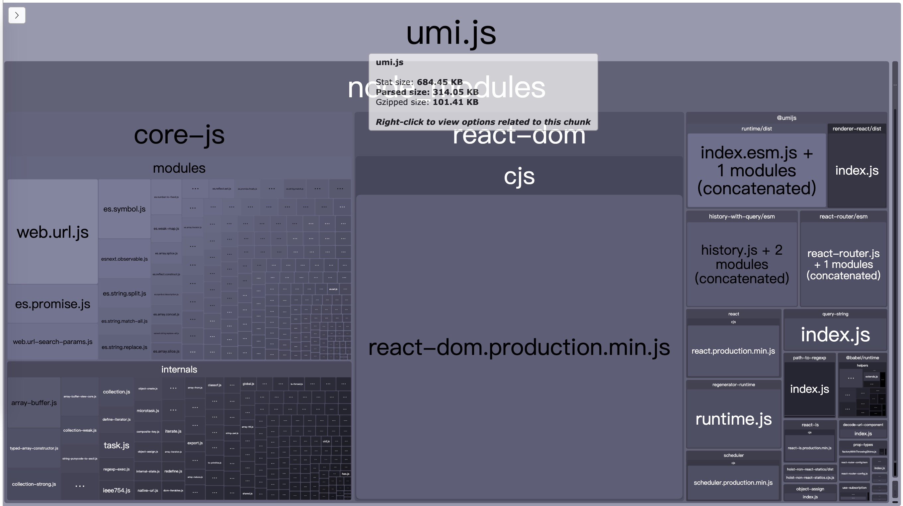
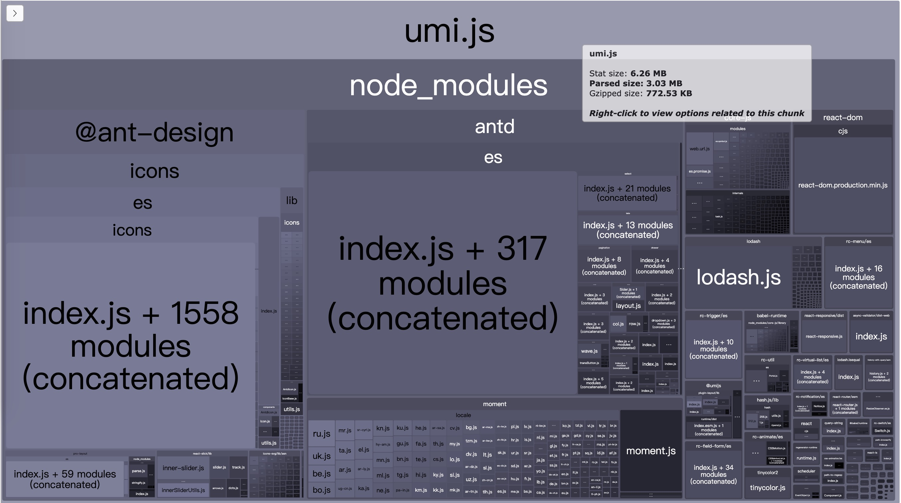
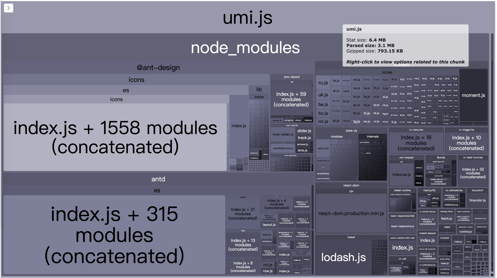
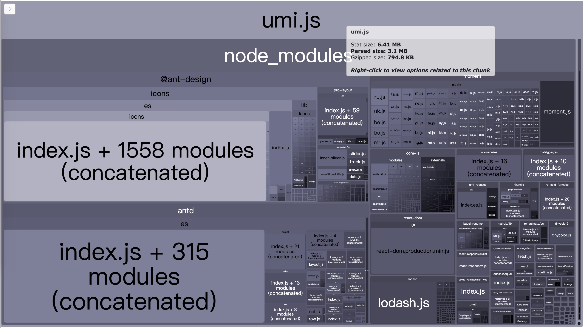
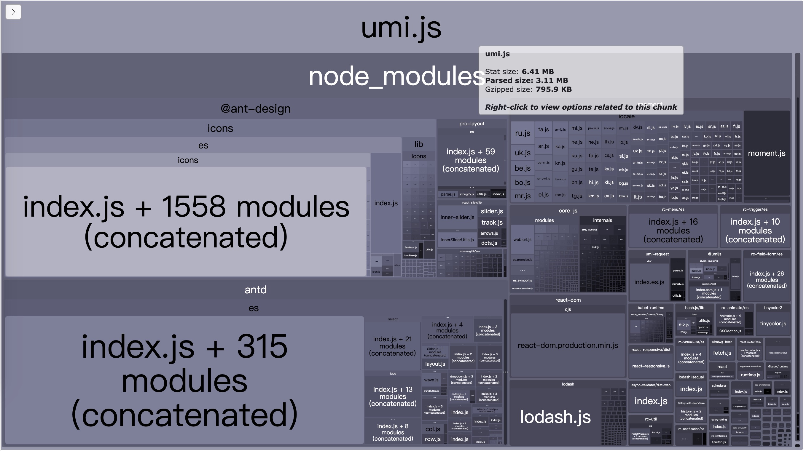
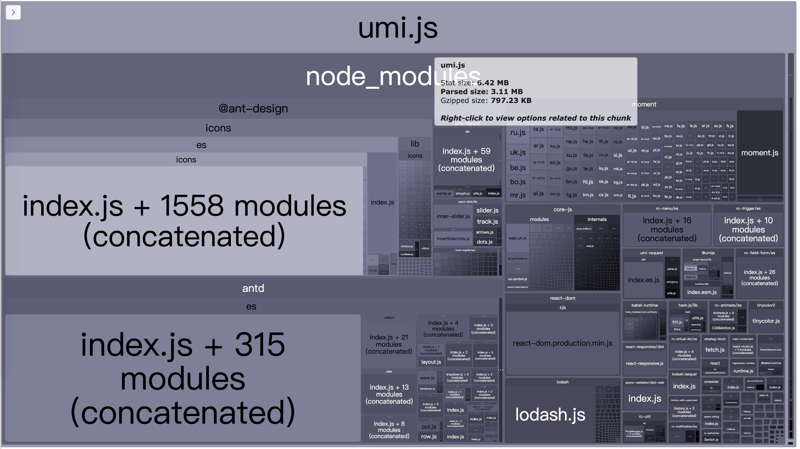
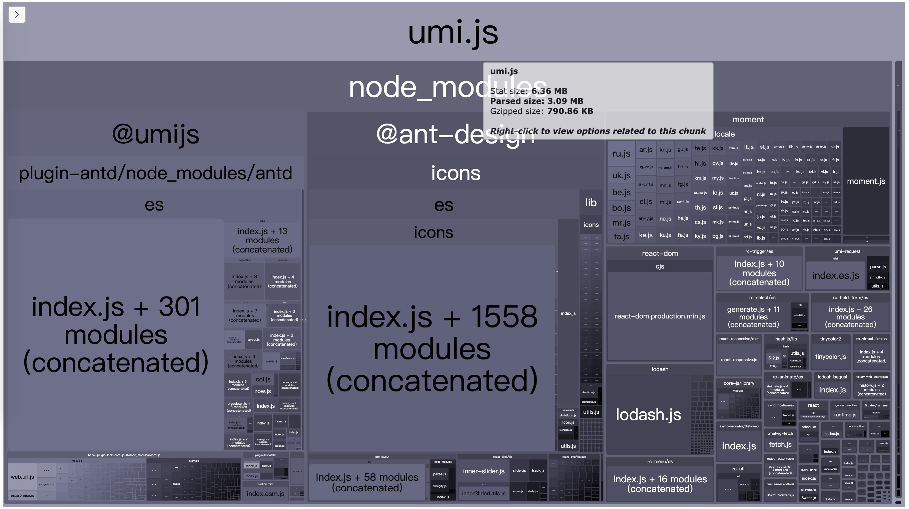
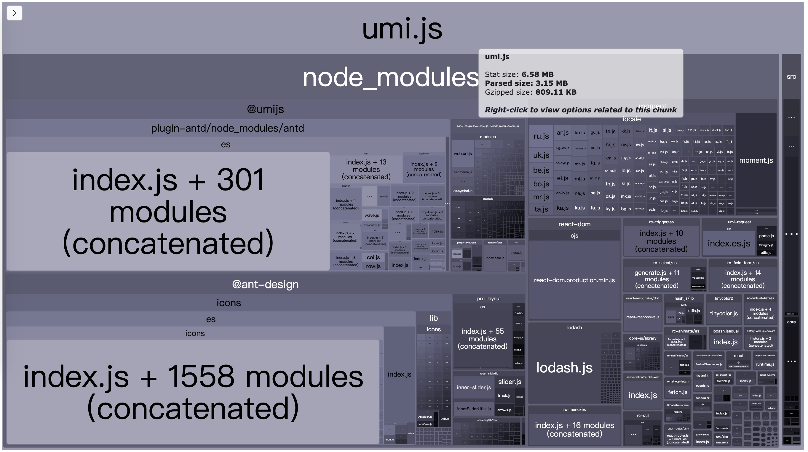
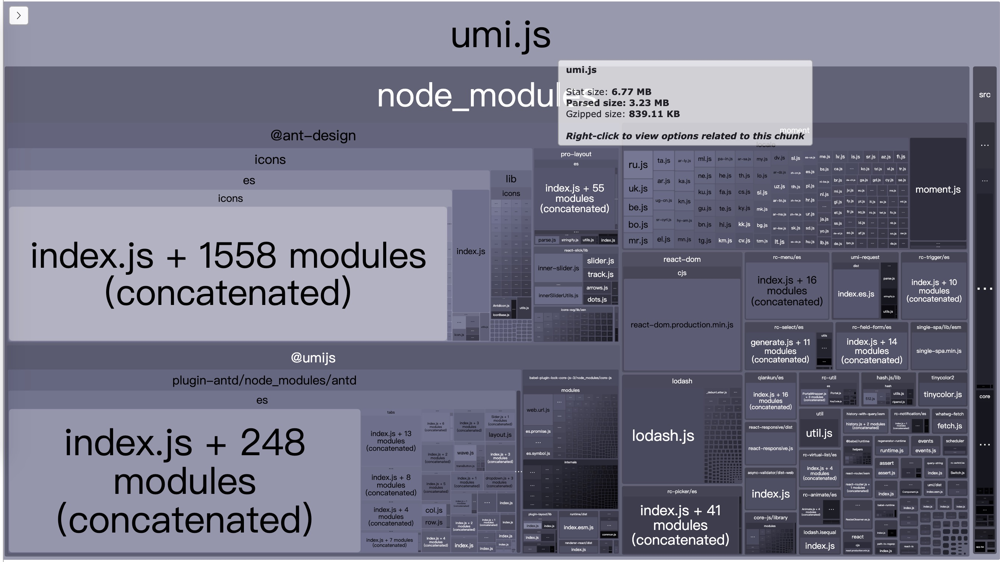

# umi next app

umi@3 全家桶方案

## [0.0.1](https://github.com/umijs/next-app/tree/001fabric) (2020-04-10)

添加工程化，初始化项目。选用 `@umijs/fabric`。

> umi.js 314.05KB

| 包名      | Parsed 大小 |
| :-------- | :---------: |
| core-js   |  121.36KB   |
| react-dom |  115.45KB   |
| internals |   49.25KB   |
| @umijs    |   17.84KB   |

## [0.0.2](https://github.com/umijs/next-app/tree/002layout) (2020-04-10)

添加布局，增加 layout 及相关配置。选用 `@umijs/plugin-layout`。

> umi.js 3.03MB

| 包名        | Parsed 大小 |
| :---------- | :---------: |
| @ant-design |   1.03MB    |
| 其中 icons  |  902.29KB   |
| antd        |  965.18KB   |
| moment      |  345.51KB   |
| @umijs      |   17.84KB   |

增加 layout 插件之后，包过大。后续[issues/4](https://github.com/umijs/next-app/issues/4)

## [0.0.3](https://github.com/umijs/next-app/tree/003request) (2020-04-10)

添加请求和 mock 数据。选用 `@umijs/plugin-request`。

> umi.js 3.1MB

| 包名        | Parsed 大小 |
| :---------- | :---------: |
| @ant-design |   1.03MB    |
| 其中 icons  |  902.29KB   |
| antd        |  965.18KB   |
| moment      |  345.51KB   |
| @umijs      |   31.92KB   |

## [0.0.4](https://github.com/umijs/next-app/tree/004models) (2020-04-10)

添加极简数据流。选用 `@umijs/plugin-model`。极简数据好像仅仅只能用于共享全局数据。因为只能在 models 里面使用 `useState`。后续[issues/2](https://github.com/umijs/next-app/issues/2)

> umi.js 3.1M

| 包名        | Parsed 大小 |
| :---------- | :---------: |
| @ant-design |   1.03MB    |
| 其中 icons  |  758.28KB   |
| antd        |  691.55KB   |
| moment      |  345.51KB   |
| @umijs      |   33.76KB   |

## [0.0.5](https://github.com/umijs/next-app/tree/005initstate) (2020-04-10)

添加项目初始化数据。选用 `@umijs/plugin-initial-state`。

> umi.js 3.11M

| 包名        | Parsed 大小 |
| :---------- | :---------: |
| @ant-design |   1.03MB    |
| 其中 icons  |  766.51KB   |
| antd        |  965.27KB   |
| moment      |  345.51KB   |
| @umijs      |   33.76KB   |

## [0.0.6](https://github.com/umijs/next-app/tree/006access) (2020-04-10)

添加权限校验，包含路由级别权限和组件级别权限。支持动态修改权限数据。选用 `@umijs/plugin-access`。

动态设置路由权限无效，权限数据有变更，权限校验无更新。后续[issues/6](https://github.com/umijs/next-app/issues/6)

> umi.js 3.11M

| 包名        | Parsed 大小 |
| :---------- | :---------: |
| @ant-design |   1.03MB    |
| 其中 icons  |  766.51KB   |
| antd        |  965.27KB   |
| moment      |  345.51KB   |
| @umijs      |   32.41KB   |

## [0.0.7](https://github.com/umijs/next-app/tree/007antd) (2020-04-10)

添加 antd 插件，预计使用按需加载 antd 使用深色主题。选用 `@umijs/plugin-antd`。

设置深色主题报错。后续[issues/7](https://github.com/umijs/next-app/issues/7)。

无按需加载组件。后续[issues/8](https://github.com/umijs/next-app/issues/8)。

> umi.js 3.09M

| 包名        | Parsed 大小 |
| :---------- | :---------: |
| @umijs      |   1.03MB    |
| 其中 antd   |  905.85KB   |
| @ant-design |   1.03MB    |
| 其中 icons  |  903.58KB   |
| moment      |  345.51KB   |

## [0.0.8](https://github.com/umijs/next-app/tree/008locale) (2020-04-10)

添加国际化，可以动态切换语言，layout 插件也支持国际化。选用 `@umijs/plugin-locale`。

国际化，antd 日期选择器无法正确切换。后续[issues/9](https://github.com/umijs/next-app/issues/9)。

> umi.js 3.15M

| 包名        | Parsed 大小 |
| :---------- | :---------: |
| @umijs      |   1.03MB    |
| 其中 antd   |  906.01KB   |
| @ant-design |   1.03MB    |
| 其中 icons  |  903.58KB   |
| moment      |  345.51KB   |

## [0.0.9]() (2020-04-13)

添加微前端。主要是添加主应用的配置，应用间的通信未添加。选用 `@umijs/plugin-qiankun`。

> umi.js 3.23M

| 包名        | Parsed 大小 |
| :---------- | :---------: |
| @umijs      |  998.88KB   |
| 其中 antd   |  839.87KB   |
| @ant-design |   1.03MB    |
| 其中 icons  |  766.51KB   |
| moment      |  345.51KB   |
